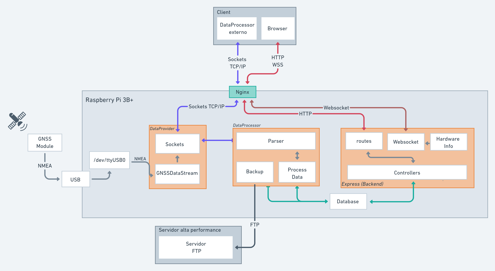

# GNSS – Ionospheric Scintillation Monitor

> Initially developed for a final paper on a computer science course

This project consists of four modules:
- **dataProvider**: permit the reading and transmitting GNSS NMEA data using sockets or WebSockets using a custom format
- **client**: connect to the dataProvider data stream and store the information on SQLite or MongoDB
- **backend/frontend**: provide an API and web interface to visualize the data and impacts of ionospheric scintillation



## How to use

Requirements:
- Node.js: v26.8.1
- NPM
- GNNS module to use as a data source
- Linux (This was tested on Windows but probaly can work on other OS with minor adjustments)
- Typescript

### Configuring the device

It's essential that you know the device name in your OS. Normally on linux it's identified as /dev/ttyUSB0, but it can vary depending on the device and operating system. I recomend running the command `ls /dev/tty*` to check the device name before and after plug in the device and see what changed.

Configure the device to receive the data via GNSS module. Giving permission to read the data via the command:
```bash
# give permission so that all users can read the data
sudo chmod 666 /dev/ttyUSB0 
# configure the transfer rate for the device, this can vary depending on the device
sudo stty -F /dev/ttyUSB0 115200
```

It's possible to thest if the device is receiving correctly using the linux cat command on the device. For example, im my computer the output of `cat /dev/ttyUSB0` is:

```nmea
$GPGGA,153718.900,2152.0707,S,05150.3215,W,1,10,0.78,400.3,M,-2.1,M,,*74
$GPGSA,A,3,03,04,22,07,14,16,30,06,02,09,,,1.53,0.78,1.32*06
$GPGSV,3,1,11,07,65,237,35.0,09,50,171,51.9,30,37,289,31.5,04,37,122,45.6*7C
$GPGSV,3,2,11,03,36,037,28.3,06,26,270,35.8,16,16,134,47.3,22,10,035,24.4*79
$GPGSV,3,3,11,14,09,343,26.1,02,09,242,29.8,08,04,064,28.6*54
$GPRMC,153718.900,A,2152.0707,S,05150.3215,W,0.01,341.19,150621,,,A*6F
$GPVTG,341.19,T,,M,0.01,N,0.03,K,A*31
```

If the data is malformed, check if the transfer rate of the device is correclty configured.

From the moment the data is received via GNSS module, it's possible to run the DataProvider. To do this, go to the dataProvider folder and run it with the command `node dist/index.js`

### Code setup

These instructions will get you a copy of the project up and running on your local machine for development and testing purposes. 

1. Visit each folder that will be used and run the command `npm i` to install the dependencies.
2. Compile the code using the command `npm run build`
3. Run the code using the command `npm start`

You can configure the dataProvider to use a different port by changing the value of the `PORT` variable in the `config.json` file. The same is applied to the client and backend.

If you are using the client to connect to the dataProvider, you can change the value of the `WS_URL` variable in the `config.json` file. This variable is used to configure the URL of the websocket server. The default value is `ws://localhost:2108`.

> It's extra mandatory to configure the dataProvider and client to use the same port and verify that they are able to communicate with each other.

Note that it's possible to run the dataProvider and client on different machines, but it's necessary to configure the firewall to allow the communication between them. For example, if the dataProvider is running on a Raspberry Pi, we can configure the firewall to allow the communication between the Raspberry Pi and the client machine. This can be done by running the command `sudo ufw allow PORT` to allow the communication between the Raspberry Pi and the client machine.

Note that it's also possible to use NGINX to expose the dataProvider to the internet.

```nginx
stream {
        server {
                listen 3000; # Porta que será exposta
                proxy_pass 127.0.0.1:2108; # Endereço local do serviço
        }
}
```

### Backend

During the development of the backend, there were some restrictions to use the same database as the client. Making necessary to run `npx prisma push` to update the schema of the database.

> An example schema of the whole project can be found [here](./TABLES.sql).

### Frontend

The frontend was developed using [React.js](https://reactjs.org/). And it can be compiled and provided by the web server nginx (by placing the compiled files in the `/var/www/html` folder) or using the public folder of the backend.

1. Run the command `npm i` to install the dependencies.
2. Build the code using the command `npm run build`
3. Run the code using the command `npm start`


---

Utils

```bash
$ sudo nginx -t # verify if the nginx configuration is correct
$ stty --help # help on stty options
$ curl cheat.sh/stty # stty cheat sheet
```